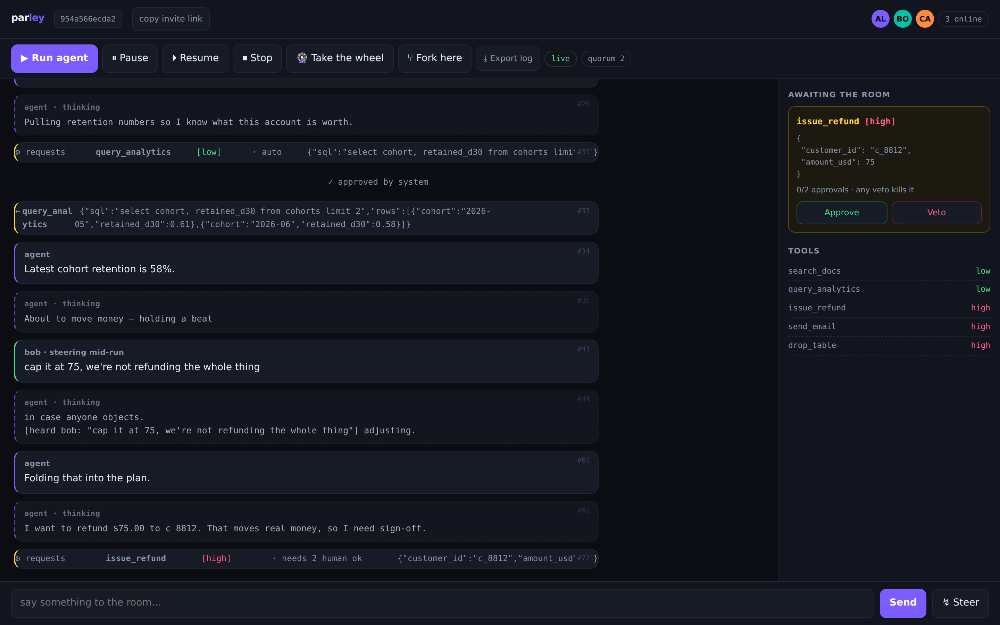
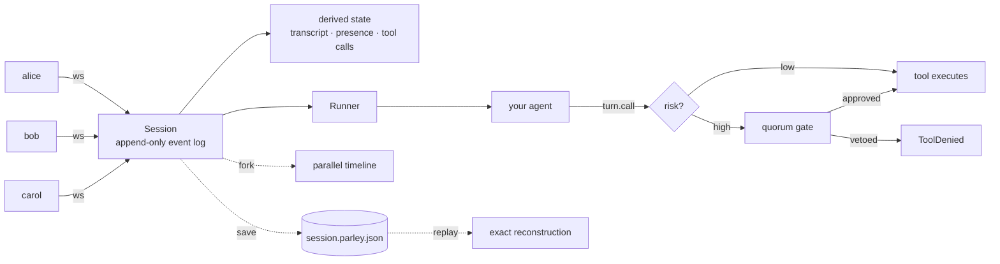

<div align="center">

# parley

**Multiplayer sessions for AI agents.**
Several humans, one agent, one shared timeline — live.

[](https://github.com/nikhil-gundawar/parley-arena/actions)
[](LICENSE)
[](https://python.org)

</div>

---

Every agent tool built so far is **single-player**. One person, one chat box, one
private run. But the work agents are being pointed at — incidents, refunds,
migrations, deploys, anything that touches production — is work teams do
*together*.

So today the pattern is: one engineer babysits an agent in their terminal, pastes
screenshots into Slack, and relays what everyone else says back into the prompt.
The team is in the loop; the loop just runs through a human copy-paste buffer.

**Parley makes the session itself the shared object.** Everyone joins the same
room, sees the same tokens land in real time, and can redirect the agent
*mid-run*. Anything irreversible stops and waits for the humans to agree.

```bash
pip install parley-ai
parley serve                     # → http://127.0.0.1:8000
# send that link to two colleagues. you're in the same agent session.
```

No API key needed to try it — a scripted agent ships in the box. Set
`ANTHROPIC_API_KEY` or `OPENAI_API_KEY` and it swaps to a real model automatically.

<div align="center">

<br/><em>alice and bob in one room. The agent wants to move $75. It doesn't move until they both say yes.</em>
</div>

---

## Five primitives you won't find elsewhere

### 1. Steer a running agent without restarting it

The thing everyone actually wants. The agent is 40 seconds into a task and going
slightly wrong. You don't stop it and re-prompt — you just say something.

```python
session.append(Event(type=EventType.STEER, actor=bob.id,
                     payload={"text": "cap the refund at 120"}))
```

The agent drains steering between every step and folds it into context. In the
demo, the refund it was about to issue changes from $240 to $120 mid-flight.

### 2. Quorum approvals on anything irreversible

Tools carry a risk label. High-risk calls **block** in the agent's own call stack
until enough humans agree. One veto kills it, regardless of how many approvals.

```python
@registry.tool(risk="high")
def issue_refund(customer_id: str, amount_usd: float): ...

session = Session("incident 421", policy=ApprovalPolicy(quorum=2,
                                                        never_approve={"drop_table"}))
```

This is the part that makes agents legible to a company rather than to one
engineer: two-person rule, hard-denied tools, and a signed record of who agreed.

### 3. Fork the timeline

Any moment in a session can be branched into a parallel run. Hover any event, hit
`⑂ fork here`, and you get a bit-for-bit identical world that diverges from that
instant. Run three of them. Compare what the agent does.

```python
child = session.fork(at_seq=47, title="what if we'd said no")
session.diff(child)   # {"common_prefix": 47, "left": [...], "right": [...]}
```

### 4. Deterministic replay

Session state is *derived* from an append-only event log, never mutated. So a
session is a file. Ship it to a teammate, replay it offline, diff two of them in
CI, keep it for the auditor.

```bash
parley replay session.parley.json
parley diff before.parley.json after.parley.json
```

That single design constraint is what makes late-joiners converge, forking exact,
and replay honest — not best-effort.

### 5. Presence and turn-taking

Live avatars, typing indicators, and a wheel one person can hold so five humans
don't talk over each other into the same agent.

---

## How it compares

| | Parley | LangGraph / CrewAI | Langfuse / LangSmith | ChatGPT & friends |
|---|---|---|---|---|
| Multiple humans in one live run | ✅ | ❌ | ❌ | ❌ |
| Steer mid-run without restarting | ✅ | ⚠️ interrupt+resume | ❌ | ❌ |
| N-of-M human approval on tools | ✅ | ⚠️ single approver | ❌ | ❌ |
| Fork a run at any point | ✅ | ❌ | ❌ | ❌ |
| Deterministic replay from a file | ✅ | ❌ | ⚠️ traces, not state | ❌ |
| Bring your own agent | ✅ | n/a | ✅ | ❌ |

Parley is not another agent framework. It's the **room** your existing agent runs
in — keep LangGraph, keep your own loop, keep whatever you have.

---

## Bring your own agent

The whole integration surface is one method.

```python
from parley import Session, Runner, ApprovalPolicy

class MyAgent:
    async def run(self, turn):
        await turn.say("looking into it")

        for nudge in turn.steering():              # humans, mid-run
            print(nudge["from"], nudge["text"])

        rows = await turn.call("query_analytics",  # low risk → just runs
                               sql="select 1")

        await turn.call("issue_refund",            # high risk → blocks on humans
                        customer_id="c_1", amount_usd=50)

session = Session("room", policy=ApprovalPolicy(quorum=2))
await Runner(session, MyAgent()).start()
```

`turn.call()` raises `ToolDenied` when the room vetoes, so your agent can adapt
instead of dying. That's it — no base class, no decorators, no DSL.

---

## Architecture



Everything that happens is an `Event` appended to the log. State is a fold over
that log. There is no other mutation path — which is the reason replay, forking
and late-join convergence are exact rather than approximate.

---

## CLI

```bash
parley serve --port 8000        # start a room server
parley headless --quorum 2      # run one agent turn in your terminal
parley headless --approve --out s.json
parley replay s.json            # deterministic replay of a saved session
parley diff a.json b.json       # compare two forked timelines
```

## Try it in 60 seconds

```bash
git clone https://github.com/nikhil-gundawar/parley-arena && cd parley-arena
pip install -e ".[dev]"
python examples/two_humans_one_agent.py     # scripted, no keys, no browser
parley serve                                # then open two browser windows
pytest -q                                   # 13 tests incl. real 2-client websocket e2e
```

## Roadmap

- [ ] Postgres-backed `SessionStore` (the engine is already storage-agnostic)
- [ ] Signed approval records — who approved what, cryptographically
- [ ] MCP server so any MCP client can join a room as a participant
- [ ] Slack + Linear participants (approve a tool call from a Slack thread)
- [ ] Fork-compare UI: run N branches side by side and score the outcomes
- [ ] Policy-as-code: quorum rules per tool, per environment, per time of day

## License

MIT.
